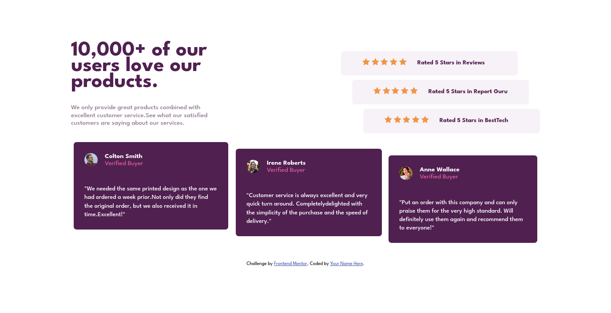

# Frontend Mentor - Testimonials grid section solution

This is a solution to the [Testimonials grid section challenge on Frontend Mentor](https://www.frontendmentor.io/challenges/testimonials-grid-section-Nnw6J7Un7). Frontend Mentor challenges help you improve your coding skills by building realistic projects. 



## Table of contents

- [Overview](#overview)
  - [The challenge](#the-challenge)
  - [Links](#links)
- [My process](#my-process)
  - [Built with](#built-with)
  - [What I learned](#what-i-learned)
  - [Useful resources](#useful-resources)
- [Author](#author)
- [Acknowledgments](#acknowledgments)


## Overview

### The challenge

Users should be able to:

- View the optimal layout for the site depending on their device's screen size
- Fixe the icone in the danial card 

### Links

- Solution URL: [Add solution URL here](https://your-solution-url.com)
- Live Site URL: [Add live site URL here](https://your-live-site-url.com)

## My process

### Built with

- Semantic HTML5 markup
- CSS custom properties
- Flexbox
- CSS Grid
- Sass 
- Mobile-first workflow

### What I learned

I leaned the sentacs of the Sass and how i can use it.

To see how you can add code snippets, see below:

```Sass
$color-Dan: hsl(263, 55%, 52%);
$color-Jona: hsl(217, 19%, 35%);
$color-Pat: hsl(219, 29%, 14%);
$color-W: hsl(0, 0%, 100%);
$color-backg:hsl(0, 0%, 81%);
$color-light-gray-blue:hsl(210, 46%, 95%);

$font: 'Barlow Semi Condensed', sans-serif;

$fw-bold:600;
$fw-regular:600;

$padding-top:1rem;

@mixin font($fw){
    font-family: $font;
    font-weight: $fw;
}
@mixin grop($FG, $ling) {
    display: $FG;
    align-items: $ling;
}
```

### Useful resources

- [Sass guide](https://sass-lang.com/guide) - This is an amazing article which helped me to leaned Sass. I'd recommend it to anyone still learning this concept.

## Author

- Frontend Mentor - [Abdessamad](https://www.frontendmentor.io/profile/kop-left)

## Acknowledgments

I recomand you to use Sass to have a clean code in CSS and  Sass helps keep large stylesheets well-organized and makes it easy to share design within and across projects.
